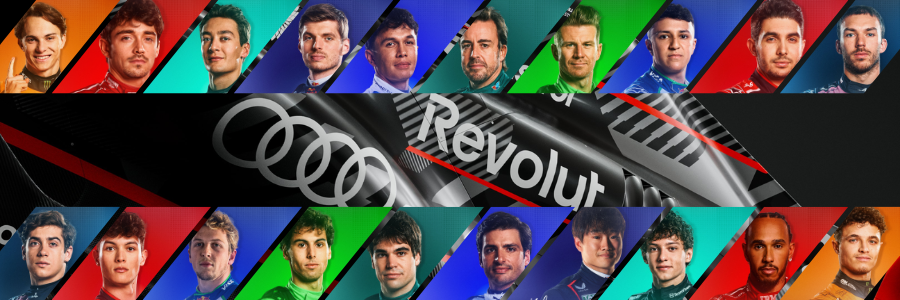

  

#  🏎 Performance Analytics for F1 Car Racing

<h3 align = "center"><i><b>Unlocking insights from every lap of Formula 1 with FastF1</i></b></h3>

<h6>Note: The project is currently in development and will be deployed in December following rigorous testing. Visuals for the project have been made available for portfolio purposes, allowing stakeholders/recruiters to view its progress and design.</h6>

---

Formula 1 is one of the most data-rich sports in the world. Every race weekend generates a massive amount of information — from lap times, pit stop strategies, and tyre choices to weather conditions, safety car deployments, and driver performance trends.  

**F1 Data Lab** is designed to bring structure and insight into this complexity by combining:  
- 📊 **Qualitative Analytics** to uncover patterns and factors influencing race outcomes.  
- 🤖 **Predictive Analytics** to predict driver finishing positions and explore strategy optimization.  
- 📈 **Data Visualizations** to create an interactive experience for fans, analysts, and stakeholders.  

This project is not only a technical showcase of **data engineering, analytics, and predictive modeling**, but also a storytelling platform that makes F1 more accessible through **clean dashboards and intuitive insights**.  

---

### 🌟 Why this project matters
- For **fans** → it provides an engaging way to understand race strategies and season dynamics.  
- For **analysts** → it demonstrates how raw sports data can be cleaned, transformed, and leveraged for insights.  
- For **recruiters/portfolio** → it highlights skills across **data pipelines, feature engineering, ML modeling, and visualization** in a real-world, complex dataset.
